# yolov5 保姆级别教入门，不会就把我头打爆。

### 前言：

仓库地址：

数据集地址：

这里引用两篇更有含金量和更详细的文章，也是他们领我进门的。

* [手把手教你使用YOLOV5训练自己的目标检测模型-口罩检测-视频教程](https://blog.csdn.net/ECHOSON/article/details/121939535)
* [爆肝6000字Yolov5保姆级教程，80岁老奶奶都看得懂！](https://blog.csdn.net/ECHOSON/article/details/121939535)

### 玩转yolov5：

* **环境配置**，多的我也不说，我搭建的环境是linux+anaconda+pytorch（gpu版，强烈要求用gpu）cuda11.4+cudnn+pycharm，详细的请看：

  [如何在pycharm中配置anaconda的虚拟环境_dejahu的博客-CSDN博客_如何在pycharm中配置anaconda](https://blog.csdn.net/ECHOSON/article/details/117220445)，但我要记录一个坑，一开始我以为pytorch（gpu版）要用到对应的cuda和cudnn版本，本地机器也要安装对应好的版本其实才能用，其实不然，只要版本高于或等于 pytorch（gpu版）要用到对应的cuda和cudnn版本就o了，反正我是装了cuda11.4的，然后pytorch用到了cuda11.3。

* **下载源码**，直接下载yolov5官方源码就好了，仓库：https://github.com/ultralytics/yolov5，

  （gitee里面也有官方库）然后把里面的用不到的文件删掉或者整合到一个doc文件夹内，包括但不限于.github文件夹，让项目看上去简洁一点，突出我们要用到的东西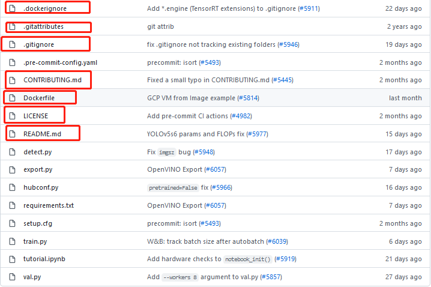

* **安装其他python库**，首先前提是在配置好的conda环境，并激活了环境`activate yolo`

  在yolov5当前目录下执行`pip install -r requirements.txt`即可，其他一切静等岁月静好。

* **测试一下**，如果一切都准备好了，可以在终端输入`python detect.py --source data/images/bus.jpg --weights pretrained/yolov5s.pt`，第一次运行应该会下载一个yolov5s.pt的模型，需要等待一下。

  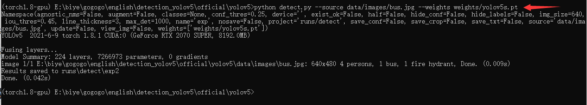

  在runs目录下可以找到检测之后的结果

  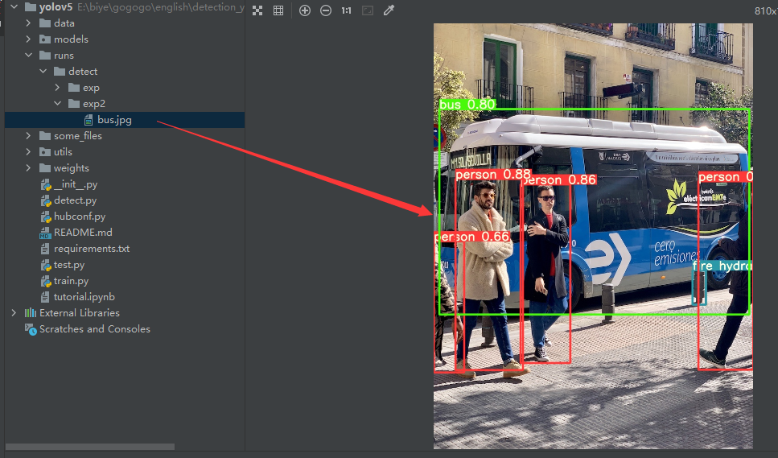

* **准备数据集**，前面所做的一切都可以理解为准备好“炼丹炉”，这一步是能否好好炼丹（训练模型）重要的一步（准备好柴火），首先得下载一个图片标注的软件labelimg，虽然或许有很多其他好的坏的标注工具，但我还是倾向于用这个，起码源码在https://github.com/tzutalin/labelImg找得到，按照以往的网上很多的教程都是把源码download下来，然后配置好环境，然后`python labelimg.py`当然现在确实也可以这样做，但我推荐你直接来一个`pip install labelimg`,然后在终端输入labelimg并回车即可进入我们的界面中来。进入之后，首先我们先把一些选项勾上，便于我们标记。然后，最重要的是把标记模式改为yolo。

  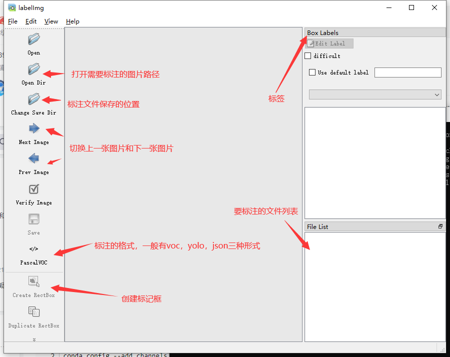

  **标注的过程是：**

  **1.打开图片目录**

  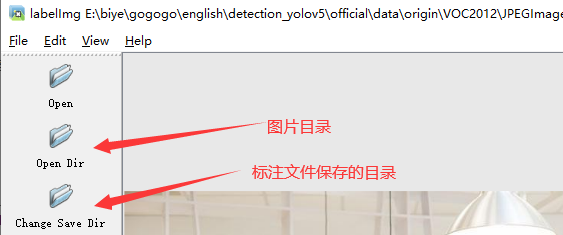

  **2.设置标注文件保存的目录并设置自动保存**

  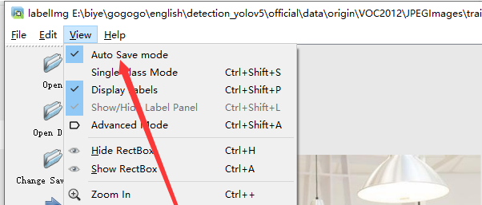

  **3.开始标注，画框，标记目标的label，`crtl+s`保存，然后d切换到下一张继续标注，不断重复重复**

  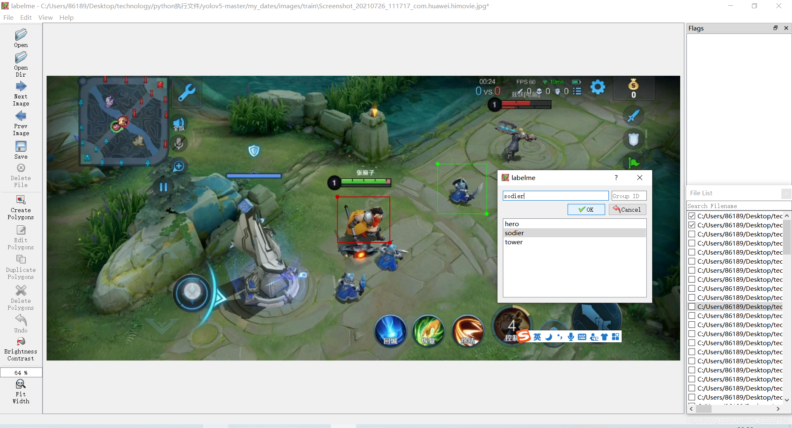

  labelimg的快捷键如下，学会快捷键可以帮助你提高数据标注的效率。

  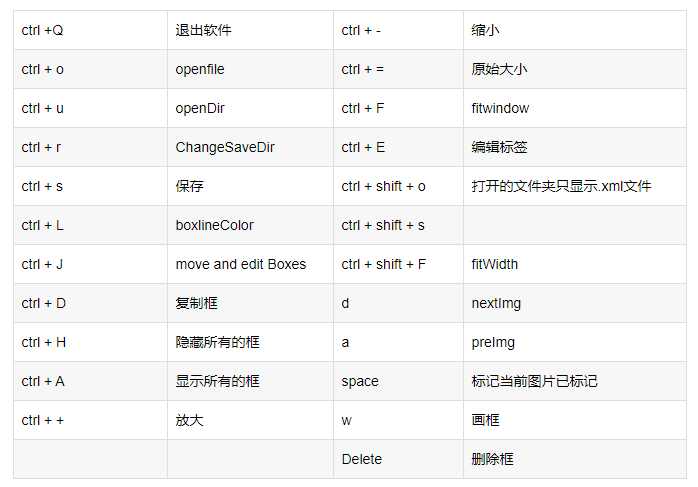

  标注完成之后你会得到一系列的txt文件，这里的txt文件就是目标检测的标注文件，其中txt文件和图片文件的名称是一一对应的，如下图所示：

  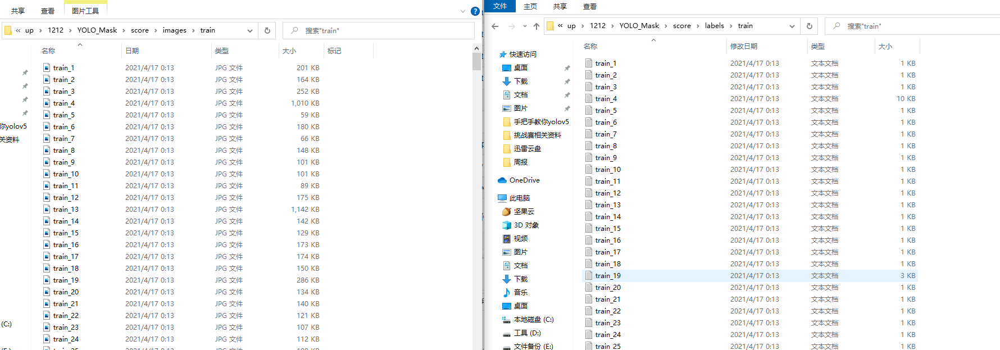

  打开具体的标注文件，你将会看到下面的内容，txt文件中每一行表示一个目标，以空格进行区分，分别表示目标的类别id，归一化处理之后的中心点x坐标、y坐标、目标框的w和h。

  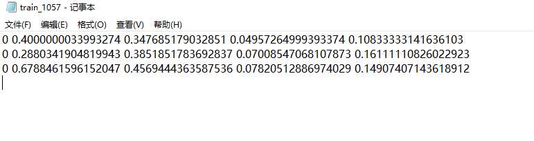

* **修改数据集配置文件**

  **我觉得这一步也十分重要，一个好的索引才方便训练的时候找到对应的训练数据集，我尝试过其他的数集文件摆放，然后就就出错了我也不知道为啥，路径啥的都是对的，所以我强烈推荐以后每一个训练无论数据集数量多少都要这样摆放**

  data_set
  └─ score
         ├─ images
         │    ├─ test # 下面放测试集图片
         │    ├─ train # 下面放训练集图片
         │    └─ val # 下面放验证集图片
         └─ labels
                ├─ test # 下面放测试集标签
                ├─ train # 下面放训练集标签
                ├─ val # 下面放验证集标签

  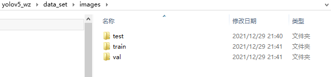

  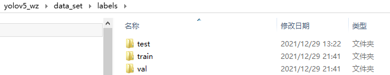

  这里的配置文件是为了方便我们后期训练使用，我们需要在data目录下创建一个`data.yaml`的文件:

  ```yaml
  # Custom data for safety helmet
  
  
  # train and val data as 1) directory: path/images/, 2) file: path/images.txt, or 3) list: [path1/images/, path2/images/]
  train: /home/lin/Desktop/pycharm_project/yolov5/data_set/images/train
  val: /home/lin/Desktop/pycharm_project/yolov5/data_set/images/val
  
  # number of classes
  nc: 10
  
  # class names
  names: ['hero', 'tower','soldier','monster','red_buff','bird','spirit','lizard','blue_buff','wolf']
  
  ```

  其中的train和val路径对应自己本地机器代码中data_set（数据集）的路径。

  nc，对应自己数据集标签中标注的数量

* **模型训练**

  * **选择一个预训练模型，可以到本项目的pretrained_model文件夹中选择，也可去[yolov5官方预训练模型文件](https://github.com/ultralytics/yolov5/releases)中下载**
  * **根据所选的预训练模型，新建一个模型配置文件，可以前往[yolov5代码仓库models文件夹](https://github.com/ultralytics/yolov5/tree/master/models)复制其中的对应文件，也可以到本项目的cfg_yaml文件夹中选择复制，然后修改为对应自己数据集的文件，主要是nc参数**

  例如采用yolov5s，数据集有10个类别：在models下建立一个`train_yolov5s.yaml`的模型配置文件，内容如下：

  ```yaml
  # YOLOv5 🚀 by Ultralytics, GPL-3.0 license
  
  # Parameters
  nc: 10  # number of classes
  depth_multiple: 0.33  # model depth multiple
  width_multiple: 0.50  # layer channel multiple
  anchors:
    - [10,13, 16,30, 33,23]  # P3/8
    - [30,61, 62,45, 59,119]  # P4/16
    - [116,90, 156,198, 373,326]  # P5/32
  
  # YOLOv5 v6.0 backbone
  backbone:
    # [from, number, module, args]
    [[-1, 1, Conv, [64, 6, 2, 2]],  # 0-P1/2
     [-1, 1, Conv, [128, 3, 2]],  # 1-P2/4
     [-1, 3, C3, [128]],
     [-1, 1, Conv, [256, 3, 2]],  # 3-P3/8
     [-1, 6, C3, [256]],
     [-1, 1, Conv, [512, 3, 2]],  # 5-P4/16
     [-1, 9, C3, [512]],
     [-1, 1, Conv, [1024, 3, 2]],  # 7-P5/32
     [-1, 3, C3, [1024]],
     [-1, 1, SPPF, [1024, 5]],  # 9
    ]
  
  # YOLOv5 v6.0 head
  head:
    [[-1, 1, Conv, [512, 1, 1]],
     [-1, 1, nn.Upsample, [None, 2, 'nearest']],
     [[-1, 6], 1, Concat, [1]],  # cat backbone P4
     [-1, 3, C3, [512, False]],  # 13
  
     [-1, 1, Conv, [256, 1, 1]],
     [-1, 1, nn.Upsample, [None, 2, 'nearest']],
     [[-1, 4], 1, Concat, [1]],  # cat backbone P3
     [-1, 3, C3, [256, False]],  # 17 (P3/8-small)
  
     [-1, 1, Conv, [256, 3, 2]],
     [[-1, 14], 1, Concat, [1]],  # cat head P4
     [-1, 3, C3, [512, False]],  # 20 (P4/16-medium)
  
     [-1, 1, Conv, [512, 3, 2]],
     [[-1, 10], 1, Concat, [1]],  # cat head P5
     [-1, 3, C3, [1024, False]],  # 23 (P5/32-large)
  
     [[17, 20, 23], 1, Detect, [nc, anchors]],  # Detect(P3, P4, P5)
    ]
  ```

  其中的nc跟data.yaml中的nc一样，对应自己数据集标签中标注的数量

  模型训练之前，请确保代码目录下有以下文件

  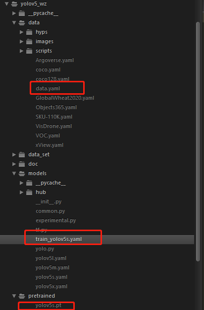

  执行下列代码运行程序即可：

  `python train.py --data data.yaml --cfg train_yolov5s.yaml --weights pretrained/yolov5s.pt --epoch 100 --batch-size 4`

  cpu版：`python train.py --data data.yaml --cfg train_yolov5s.yaml --weights pretrained/yolov5s.pt --epoch 100 --batch-size 4 --device cpu`

  训练代码成功执行之后会在命令行中输出下列信息，接下来就是安心等待模型训练结束即可。

  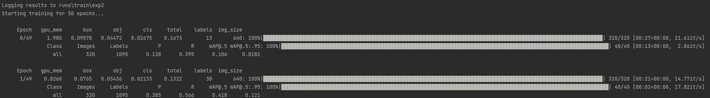

  根据数据集的大小和设备的性能，经过漫长的等待之后模型就训练完了，输出如下：

  

  在`train/runs/exp2`的目录下可以找到训练得到的模型和日志文件

  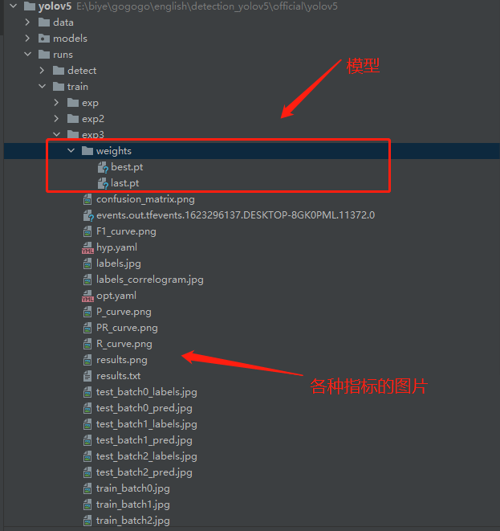

  模型评估

  出了在博客一开头你就能看到的检测效果之外，还有一些学术上的评价指标用来表示我们模型的性能，其中目标检测最常用的评价指标是mAP，mAP是介于0到1之间的一个数字，这个数字越接近于1，就表示你的模型的性能更好。

  一般我们会接触到两个指标，分别是召回率recall和精度precision，两个指标p和r都是简单地从一个角度来判断模型的好坏，均是介于0到1之间的数值，其中接近于1表示模型的性能越好，接近于0表示模型的性能越差，为了综合评价目标检测的性能，一般采用均值平均密度map来进一步评估模型的好坏。我们通过设定不同的置信度的阈值，可以得到在模型在不同的阈值下所计算出的p值和r值，一般情况下，p值和r值是负相关的，绘制出来可以得到如下图所示的曲线，其中曲线的面积我们称AP，目标检测模型中每种目标可计算出一个AP值，对所有的AP值求平均则可以得到模型的mAP值，以本文为例，我们可以计算佩戴安全帽和未佩戴安全帽的两个目标的AP值，我们对两组AP值求平均，可以得到整个模型的mAP值，该值越接近1表示模型的性能越好。

  关于更加学术的定义大家可以在知乎或者csdn上自行查阅，以我们本次训练的模型为例，在模型结束之后你会找到三张图像，分别表示我们模型在验证集上的召回率、准确率和均值平均密度。

  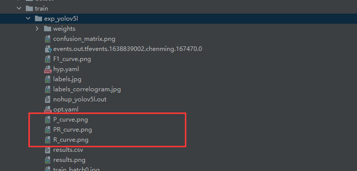

  更多细节参考[手把手教你使用YOLOV5训练自己的目标检测模型-口罩检测-视频教程](https://blog.csdn.net/bu_fo/article/details/110921169)

* 模型使用

  ```bash
   # 检测摄像头
   python detect.py  --weights runs/train/exp_yolov5s/weights/best.pt --source 0  # webcam
   # 检测图片文件
    python detect.py  --weights runs/train/exp_yolov5s/weights/best.pt --source file.jpg  # image 
   # 检测视频文件
     python detect.py --weights runs/train/exp_yolov5s/weights/best.pt --source file.mp4  # video
   # 检测一个目录下的文件
    python detect.py --weights runs/train/exp_yolov5s/weights/best.pt path/  # directory
   # 检测网络视频
    python detect.py --weights runs/train/exp_yolov5s/weights/best.pt --source 'https://youtu.be/NUsoVlDFqZg'  # YouTube video
   # 检测流媒体
    python detect.py --weights runs/train/exp_yolov5s/weights/best.pt --source 'rtsp://example.com/media.mp4'  # RTSP, RTMP, HTTP stream                            
  ```

* onnx模型实验(yolov5的第六版才有dnn这个参数)

  ```bash
  python detect.py --weights yolov5n.onnx --dnn --source file.mp4 
  ```

